# Word GPT Plus - Hyperion 2.0.0 Architecture

## Executive Summary

**Hyperion 2.0.0** represents a complete architectural overhaul of Word GPT Plus, transforming it from a monolithic codebase into a modular, maintainable, and extensible system. This document serves as the comprehensive architecture guide for the refactored application.

## Architecture Overview

### Core Principles

1. **Modularity**: Components are separated by concern with clear boundaries
2. **Type Safety**: Comprehensive TypeScript coverage with runtime validation
3. **Reactivity**: Unified state management with Vue's reactivity system
4. **Extensibility**: Designed for easy addition of new providers and tools
5. **User Transparency**: Clear visibility into agent operations

### High-Level Architecture

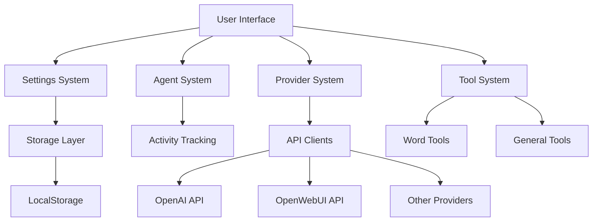

## 1. Settings System Architecture

### 1.1 Component Structure

```
src/settings/
├── schema.ts           # Zod validation schemas
├── storage.ts          # Storage abstraction
├── useSettings.ts      # Reactive composable
└── providers.ts        # Provider-specific settings
```

### 1.2 Data Flow

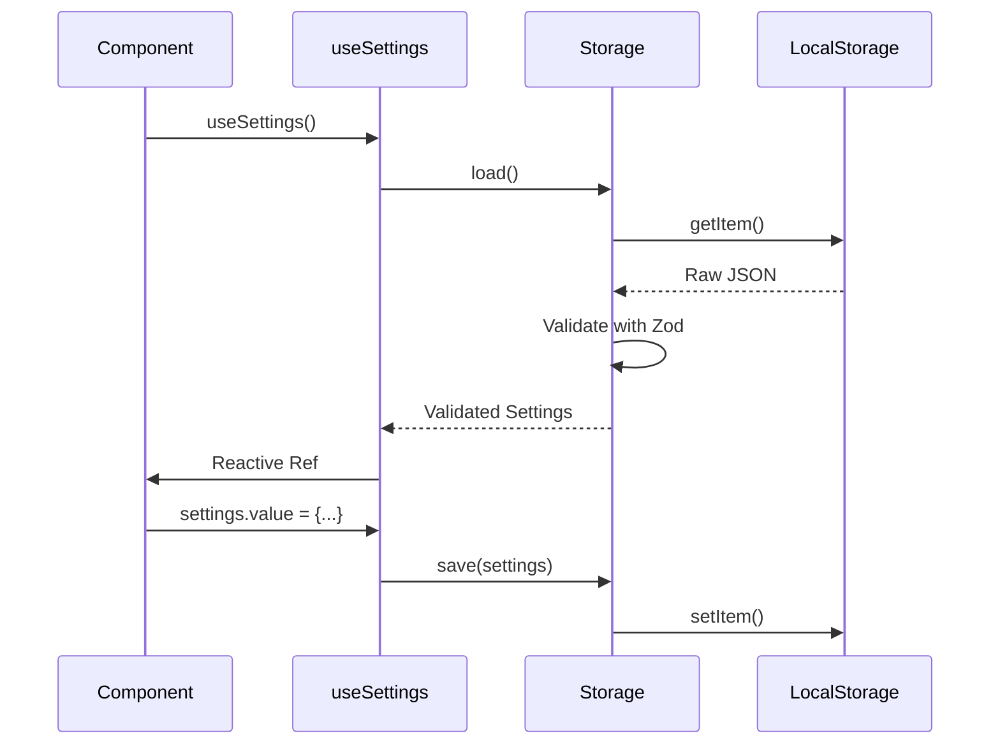

### 1.3 Schema Validation

```typescript
// Example: SettingsSchema validation
const SettingsSchema = z.object({
  localLanguage: z.enum(['en', 'zh-CN']).default('zh-CN'),
  openwebui: z.object({
    knowledgeBase: z.object({
      enabled: z.boolean().default(false),
      selectedCollections: z.array(z.string()).default([]),
      searchType: z.enum(['similarity', 'mmr', 'similarity_score_threshold']),
      topK: z.number().min(1).max(20),
    }),
  }),
})
```

## 2. Type System Architecture

### 2.1 Centralized Type Structure

```
src/types/
├── index.ts            # Barrel exports
├── providers.ts        # LLM provider types
├── tools.ts            # Tool definitions
├── settings.ts         # Settings types
├── errors.ts           # Error handling
└── common.ts           # Utility types
```

### 2.2 Type Hierarchy

```mermaid
classDiagram
    class ProviderOptions {
        <<interface>>
        +messages: Messages
        +result: Ref<string>
        +loading: Ref<boolean>
    }
    
    class OpenAIOptions {
        <<interface>>
        +provider: 'official'
        +config: { apiKey: string }
    }
    
    class OpenWebUIOptions {
        <<interface>>
        +provider: 'openwebui'
        +ragEnabled: boolean
        +selectedKnowledgeBases: string[]
    }
    
    ProviderOptions <|-- OpenAIOptions
    ProviderOptions <|-- OpenWebUIOptions
    ProviderOptions <|-- OllamaOptions
    ProviderOptions <|-- GroqOptions
    ProviderOptions <|-- GeminiOptions
    ProviderOptions <|-- AzureOptions
    ProviderOptions <|-- MistralOptions
```

## 3. Error Handling System

### 3.1 Error Type Hierarchy

```typescript
export enum ErrorType {
  AUTHENTICATION = 'AUTHENTICATION',
  RATE_LIMIT = 'RATE_LIMIT',
  NETWORK = 'NETWORK',
  INVALID_MODEL = 'INVALID_MODEL',
  QUOTA_EXCEEDED = 'QUOTA_EXCEEDED',
  INVALID_REQUEST = 'INVALID_REQUEST',
  UNKNOWN = 'UNKNOWN',
}

export class LLMError extends Error {
  constructor(
    public type: ErrorType,
    message: string,
    public userMessage: string,
    public troubleshootingUrl?: string,
    public originalError?: Error
  ) {
    super(message)
    this.name = 'LLMError'
  }
}
```

### 3.2 Error Handling Flow

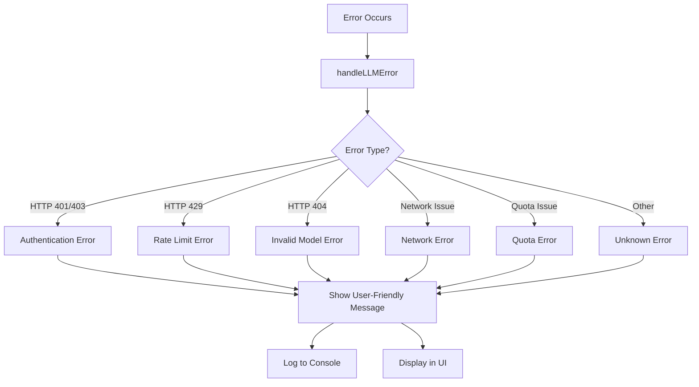

## 4. Agent System Architecture

### 4.1 Agent Activity Panel

```
src/components/AgentActivityPanel.vue
├── Mode Indicator
├── Activity Log
├── Tool Selection Panel
└── Execution Progress
```

### 4.2 Activity Tracking

```typescript
interface Activity {
  id: string
  type: 'tool_call' | 'tool_result' | 'thinking'
  timestamp: Date
  toolName?: string
  args?: any
  result?: any
  thought?: string
  status?: 'pending' | 'success' | 'error'
}
```

### 4.3 Agent Workflow

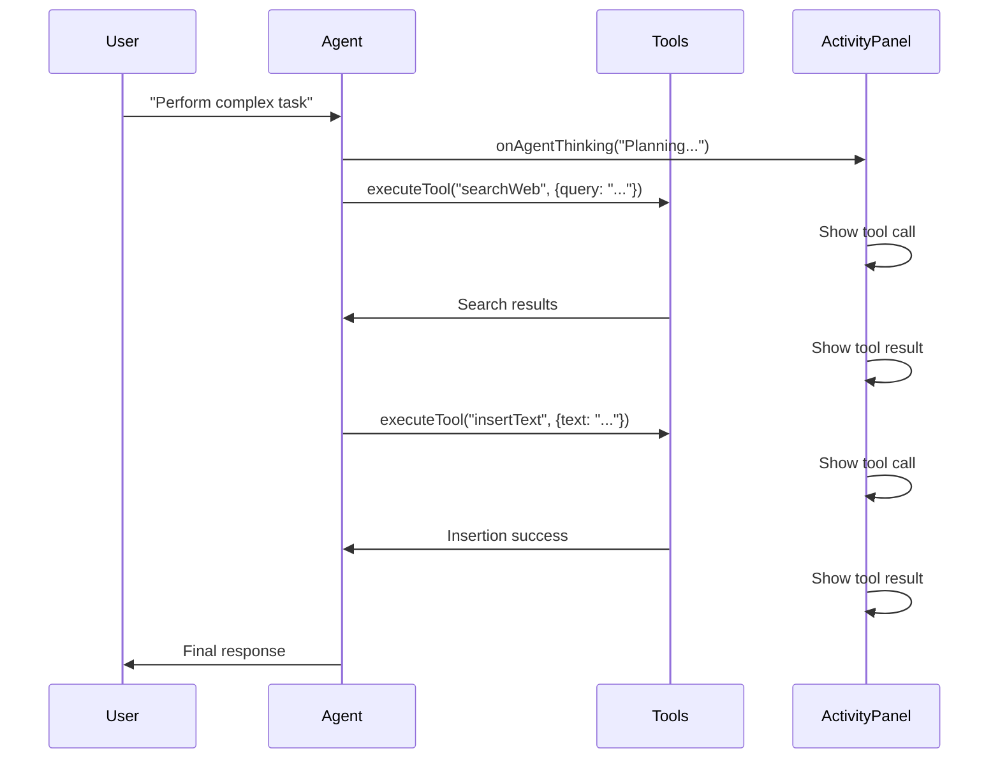

## 5. OpenWebUI RAG Integration

### 5.1 RAG API Client

```
src/api/openwebui-rag.ts
├── fetchKnowledgeBases()
├── fetchCollections()
└── queryKnowledge()
```

### 5.2 RAG Settings Component

```
src/components/OpenWebUIRagSettings.vue
├── RAG Toggle Switch
├── Knowledge Base Selector
├── Search Type Configuration
└── Top K Configuration
```

### 5.3 RAG Data Flow

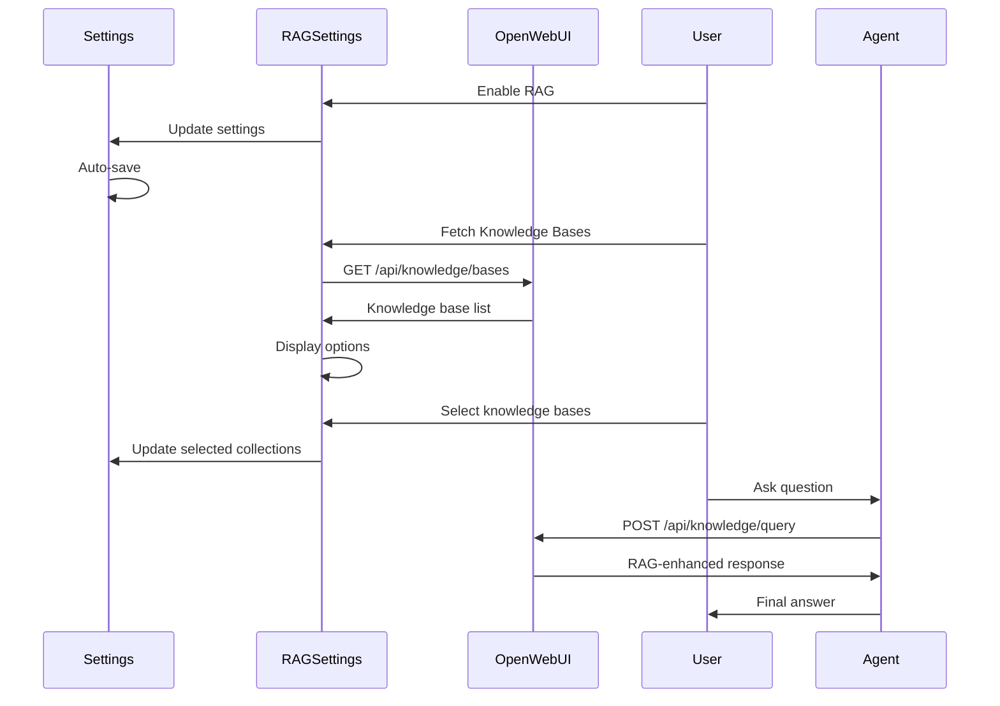

## 6. Tool System Architecture

### 6.1 Modular Tool Structure

```
src/utils/wordTools/
├── index.ts                    # Main exports
├── types.ts                    # Type definitions
├── text-tools.ts               # Text manipulation
├── formatting-tools.ts         # Text formatting
├── structure-tools.ts          # Document structure
├── document-tools.ts           # Document operations
├── navigation-tools.ts         # Navigation tools
└── content-control-tools.ts    # Content controls
```

### 6.2 Tool Definition Structure

```typescript
export interface WordToolDefinition {
  name: string
  description: string
  inputSchema: ToolInputSchema
  execute: (args: Record<string, any>) => Promise<string>
}

export interface ToolInputSchema {
  type: 'object'
  properties: Record<string, ToolProperty>
  required?: string[]
}
```

### 6.3 Tool Creation Pipeline

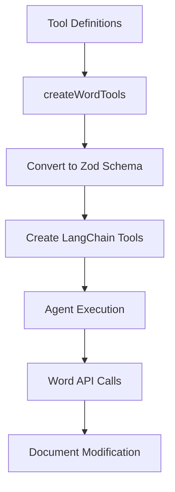

## 7. Provider System Architecture

### 7.1 Provider Interface

```typescript
export interface BaseChatCompletionOptions {
  messages: Messages
  result: Ref<string>
  errorIssue: Ref<boolean>
  loading: Ref<boolean>
  maxTokens?: number
  temperature?: number
  abortSignal?: AbortSignal
  threadId: string
  onStream: (text: string) => void
}
```

### 7.2 Provider Factory Pattern

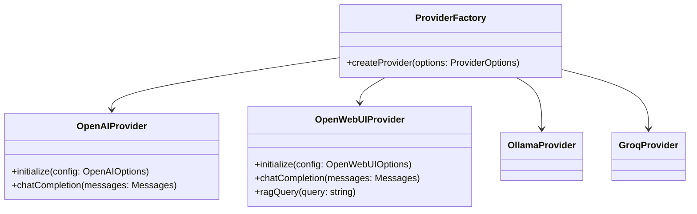

## 8. State Management Architecture

### 8.1 Reactive State Flow

```mermaid
graph LR
    A[Vue Components] --> B[useSettings]
    B --> C[Ref<Settings>]
    C --> D[Watch Effect]
    D --> E[SettingsStorage.save()]
    E --> F[LocalStorage]
    F --> G[Persistent Storage]
```

### 8.2 Settings Initialization Flow

```mermaid
flowchart TD
    A[Component Mounts] --> B[useSettings()]
    B --> C{migratedSettings = migrateFromLegacy()}
    C --> D[storedSettings = loadFromStorage()]
    D --> E[initialSettings = merge(migrated, stored)]
    E --> F[settingsInstance = ref(initialSettings)]
    F --> G[watch(settingsInstance, autoSave)]
    G --> H[Return reactive ref]
```

## 9. Migration Strategy

### 9.1 Legacy Settings Migration

```typescript
static migrateFromLegacy(): Settings {
  // Read from old localStorage keys
  const legacySettings = {
    localLanguage: localStorage.getItem('localLanguage') || 'zh-CN',
    openaiAPIKey: localStorage.getItem('openaiAPIKey') || '',
    // ... other legacy keys
  }
  
  // Convert to new structure
  return {
    ...defaultSettings,
    localLanguage: legacySettings.localLanguage as 'en' | 'zh-CN',
    openai: {
      apiKey: legacySettings.openaiAPIKey,
      // ... other openai settings
    },
  }
}
```

### 9.2 Migration Flow

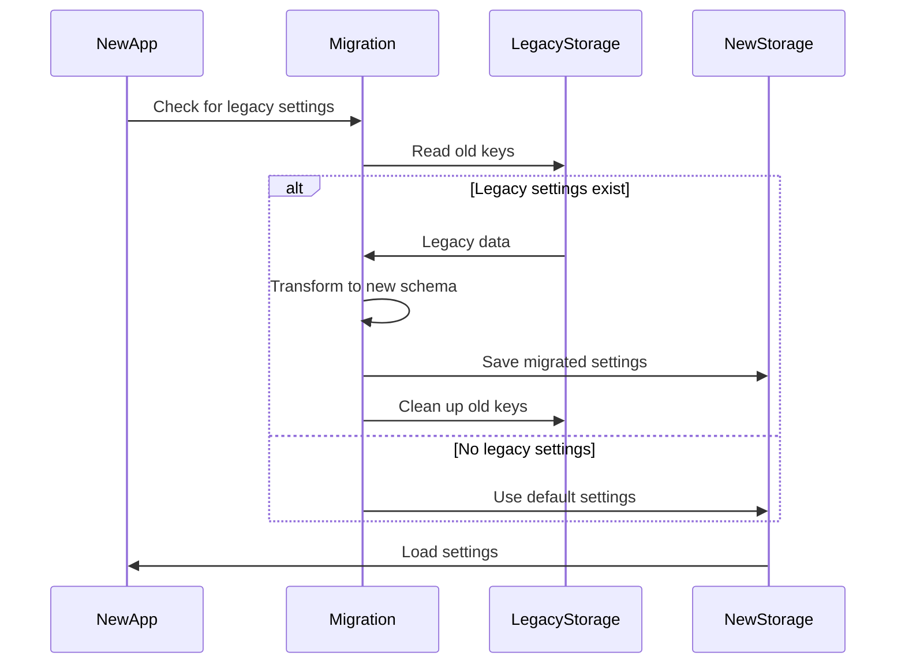

## 10. Performance Considerations

### 10.1 Lazy Loading Strategy

```javascript
// Dynamic imports for heavy components
const AgentActivityPanel = defineAsyncComponent(() =>
  import('./components/AgentActivityPanel.vue')
)
```

### 10.2 Caching Strategy

```typescript
// Knowledge base caching
const knowledgeBaseCache = new Map<string, KnowledgeBase[]>()

async function getKnowledgeBases(baseURL: string, jwtToken: string) {
  const cacheKey = `${baseURL}:${jwtToken}`
  
  if (knowledgeBaseCache.has(cacheKey)) {
    return knowledgeBaseCache.get(cacheKey)!
  }
  
  const bases = await fetchKnowledgeBases(baseURL, jwtToken)
  knowledgeBaseCache.set(cacheKey, bases)
  return bases
}
```

## 11. Security Architecture

### 11.1 API Key Management

```typescript
// Secure storage pattern
class SecureStorage {
  static encrypt(value: string): string {
    // Implement encryption logic
    return encryptedValue
  }
  
  static decrypt(value: string): string {
    // Implement decryption logic
    return decryptedValue
  }
}
```

### 11.2 Input Validation

```typescript
// Zod validation for all external inputs
const ApiKeySchema = z.string()
  .min(8, "API key too short")
  .max(128, "API key too long")
  .refine(value => /^[A-Za-z0-9_-]+$/.test(value), "Invalid API key format")
```

## 12. Testing Strategy

### 12.1 Test Coverage Areas

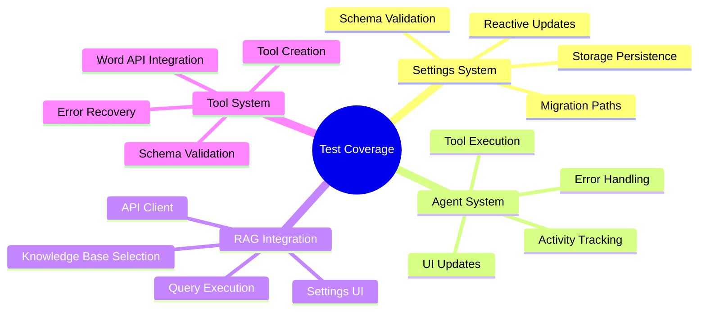

### 12.2 Test Examples

```typescript
// Settings validation test
test('Settings schema validation', () => {
  const validSettings = {
    localLanguage: 'en',
    provider: 'official',
    openai: {
      apiKey: 'test-key',
      baseURL: 'https://api.openai.com/v1',
    },
  }
  
  expect(() => SettingsSchema.parse(validSettings)).not.toThrow()
})

// Error handling test
test('Error handling for 401 responses', () => {
  const mockError = {
    response: { status: 401 }
  }
  
  const error = handleLLMError(mockError)
  expect(error.type).toBe(ErrorType.AUTHENTICATION)
  expect(error.userMessage).toContain('Authentication failed')
})
```

## 13. Deployment Architecture

### 13.1 Deployment Flow

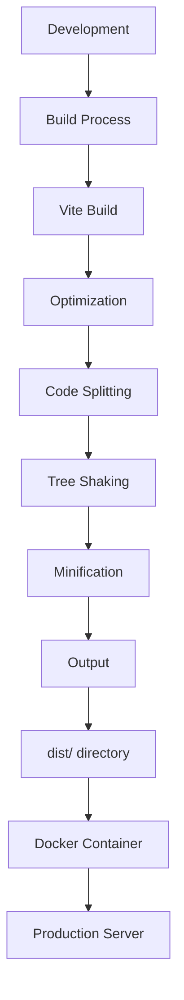

### 13.2 Rollback Strategy

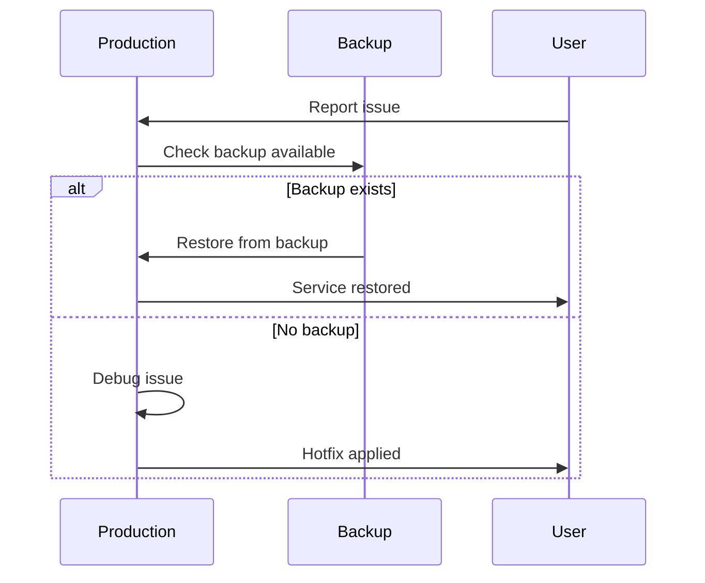

## 14. Monitoring and Analytics

### 14.1 Error Monitoring

```typescript
// Error tracking integration
class ErrorTracker {
  static track(error: LLMError, context: Record<string, any>) {
    // Send to monitoring service
    monitoringService.log({
      type: error.type,
      message: error.message,
      userMessage: error.userMessage,
      context,
      timestamp: new Date().toISOString(),
    })
  }
}
```

### 14.2 Usage Analytics

```typescript
// Analytics events
class Analytics {
  static trackToolUsage(toolName: string, success: boolean) {
    analyticsService.track('tool_usage', {
      tool: toolName,
      success,
      timestamp: new Date().toISOString(),
    })
  }
  
  static trackAgentActivity(activityType: string) {
    analyticsService.track('agent_activity', {
      type: activityType,
      timestamp: new Date().toISOString(),
    })
  }
}
```

## 15. Future Extensibility

### 15.1 Adding New Providers

```typescript
// Example: Adding a new provider
interface NewProviderOptions extends BaseChatCompletionOptions {
  provider: 'newprovider'
  newProviderAPIKey: string
  newProviderModel: string
}

// Update provider types
export type ProviderOptions =
  | OpenAIOptions
  | OpenWebUIOptions
  | NewProviderOptions  // ← Add new provider

// Update supported providers
export type SupportedProviders =
  | 'official'
  | 'openwebui'
  | 'newprovider'  // ← Add new provider
```

### 15.2 Adding New Tools

```typescript
// Example: Adding a new word tool
const newTools: Record<string, WordToolDefinition> = {
  exportToPDF: {
    name: 'exportToPDF',
    description: 'Export the current document to PDF format.',
    inputSchema: {
      type: 'object',
      properties: {
        fileName: {
          type: 'string',
          description: 'Name for the PDF file',
        },
      },
      required: [],
    },
    execute: async args => {
      const { fileName = 'document' } = args
      return Word.run(async context => {
        // PDF export logic
        return `Exported to ${fileName}.pdf`
      })
    },
  },
}

// Add to main exports
export const wordToolDefinitions: Record<WordToolName, WordToolDefinition> = {
  ...textTools,
  ...formattingTools,
  ...newTools,  // ← Add new tools
}
```

## 16. Architecture Benefits

### 16.1 Before vs After Comparison

| Aspect | Before Hyperion | After Hyperion |
|--------|----------------|----------------|
| **Settings Management** | 4 fragmented systems | Unified schema-based system |
| **Type Safety** | Scattered types | Centralized type system |
| **Error Handling** | Generic messages | Typed errors with user messages |
| **Agent Transparency** | Invisible operations | Full activity tracking |
| **RAG Support** | Not available | Full OpenWebUI integration |
| **Code Organization** | Monolithic files | Modular components |
| **Maintainability** | High complexity | Clean architecture |
| **Extensibility** | Difficult | Easy to extend |

### 16.2 Key Improvements

1. **Reduced Complexity**: Settings management consolidated from 4 systems to 1
2. **Improved Type Safety**: Comprehensive TypeScript coverage with runtime validation
3. **Better User Experience**: Transparent agent operations with activity tracking
4. **Enhanced Functionality**: OpenWebUI RAG integration for knowledge-based responses
5. **Cleaner Codebase**: Modular architecture with clear separation of concerns
6. **Easier Maintenance**: Standardized patterns and conventions
7. **Future-Proof**: Designed for easy extension and growth

## 17. Conclusion

**Hyperion 2.0.0** represents a significant architectural leap forward for Word GPT Plus. The refactored system provides:

- **Clean, maintainable codebase** with clear separation of concerns
- **Robust settings system** with validation and migration support
- **Transparent agent operations** for better user understanding
- **Advanced RAG capabilities** through OpenWebUI integration
- **Comprehensive error handling** with user-friendly messages
- **Modular design** for easy extension and maintenance

This architecture positions Word GPT Plus for continued growth and innovation while maintaining stability and reliability.

## Appendix: File Structure Reference

```
src/
├── settings/                  # Unified settings system
│   ├── schema.ts              # Zod validation schemas
│   ├── storage.ts             # Storage abstraction
│   ├── useSettings.ts         # Reactive composable
│   └── providers.ts           # Provider-specific settings
│
├── types/                     # Centralized type system
│   ├── index.ts               # Barrel exports
│   ├── providers.ts           # LLM provider types
│   ├── tools.ts               # Tool definitions
│   ├── settings.ts            # Settings types
│   ├── errors.ts              # Error handling
│   └── common.ts              # Utility types
│
├── utils/
│   ├── wordTools/             # Modular tool system
│   │   ├── index.ts           # Main exports
│   │   ├── types.ts           # Type definitions
│   │   ├── text-tools.ts      # Text manipulation
│   │   ├── formatting-tools.ts # Text formatting
│   │   ├── structure-tools.ts  # Document structure
│   │   ├── document-tools.ts   # Document operations
│   │   ├── navigation-tools.ts # Navigation tools
│   │   └── content-control-tools.ts # Content controls
│   └── errorHandler.ts        # Error handling utility
│
├── api/
│   ├── openwebui-rag.ts       # RAG API client
│   └── ...                    # Other API clients
│
├── components/
│   ├── AgentActivityPanel.vue # Agent activity tracking
│   └── OpenWebUIRagSettings.vue # RAG settings UI
│
└── pages/
    ├── HomePage.vue           # Main interface
    └── SettingsPage.vue        # Settings with RAG integration
```

## Glossary

- **RAG**: Retrieval-Augmented Generation - Enhancing LLM responses with knowledge base retrieval
- **Zod**: TypeScript-first schema validation library
- **LangChain**: Framework for building LLM-powered applications
- **Vue Composable**: Reusable logic encapsulated in functions
- **Provider**: LLM service provider (OpenAI, OpenWebUI, etc.)
- **Tool**: Word/GPT functionality exposed to agents
- **Agent**: Autonomous system that can use tools to complete tasks